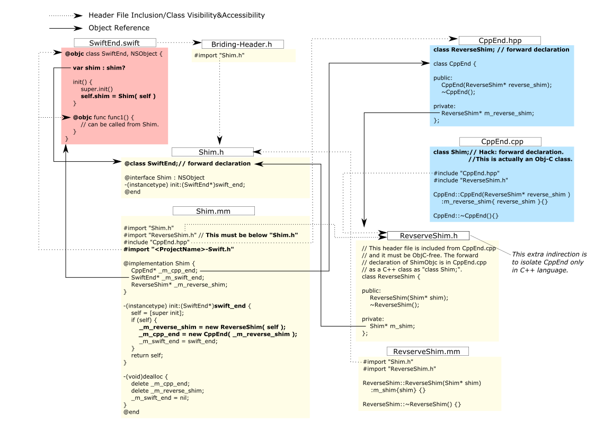

# Swift-ObjC-Cpp Interoperability
This is a tiny sample project to show a technique for the two-way communication between one **Swift** object and another in **C++** via Objective-C.

# Background and Motivation
The *bridging header* makes it possible for Swift objects to access Obj-C objects. And *[Project]-Swift.h* precompiled header makes it possible for Obj-C objects to access Swift objects, whose classes and functions are makred by `@objc`. The interoperability between Obj-C and C++ are well defined, though it is a bit cumbersome, if you want to completely isolate the C++ code from the Obj-C++.
It becomes a bit tricky when you want to achieve the communication in both ways, as you have to cope with some cyclic definition situations with some forward declarations. And it is probably worth making a project for my own future reference and others.

# Overview

* `SwiftEnd.swift` : The Swift class that communicates with `CppEnd`. It instantiates and owns `Shim`.

* `CppEnd.{hpp,cpp}` : The C++ class that commnicates with `SwiftEnd`. It is instantiated by `Shim`. It has a reference to `ReverseShim`.

* `Shim.{h,mm}` : The shim in Obj-C class. It instantiates and owns `CppEnd` and `ReverseShim`. It has a reference to `SwiftEnd`.

* `ReverseShim.{h,mm}` : Another small shim in C++ class with some Obj-C code inits implementation. It has a reference to `Shim`. It facilitates the communication from `CppEnd` to `Shim`.

# Call Sequence in the Sample Program.

The `SwiftEnd` object is instantiated in `App` and it is pushed to SwiftUI as an environment object.
It is picked up in `ContentView`. The button in the view calls `SwiftEnd`'s `callCpp()` function.

1. ContentView calls SwiftEnd.callToCpp()
2. SwiftEnd's callCpp() calls [ Shim callToCPP ].
3. Shim calls CppEnd::receiveFromSwift().
4. CppEnd' receiveFromSwift() in turn calls ReverseShim::callToSwift().
5. ReverseShim's callToSwift() calls [ Shim callToSwift ].
6. Shim's callToSwift calls SwiftEnd.receiveFromCpp().

This call chain makes a roundtrip from SwiftEnd to CppEnd and back to SwiftEnd.
